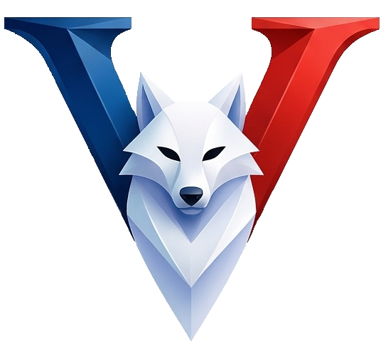

<!-- ═══════════════════════════════════════════════════ HERO -->

 

<h1>VAD-N Numérique</h1>

 

---

<!-- ════════════════════════════════════════════ NOS ACTIVITÉS -->

## Nos activités

*Trois domaines de développement, une même exigence technique.*

 

**💻 &nbsp;Applications**

> Développement d'applications web et mobiles. Interfaces modernes, architectures solides, déploiement multiplateforme.

**🖥️ &nbsp;Logiciels**

> Conception de logiciels desktop et d'outils métiers. Solutions pensées pour durer, maintenables et adaptées aux usages réels.

**🎮 &nbsp;Jeux vidéo**

> Développement de jeux 2D et 3D pour PC, mobile ou web. De la conception du gameplay à l'intégration des assets.

---

<!-- ══════════════════════════════════════════════════ FOOTER -->

[vad-n.fr](https://vad-n.fr) &nbsp;·&nbsp; [contact@vad-n.fr](mailto:contact@vad-n.fr) &nbsp;·&nbsp; [Mentions légales](https://vad-n.fr/mentions-legales)

 

© 2026 VAD-N Numérique · Tous droits réservés.

